<!-- Place this tag in your head or just before your close body tag. -->
<script async defer src="https://buttons.github.io/buttons.js"></script>
<div style="text-align:center">
    <!-- star -->
    <a class="github-button" href="https://github.com/codycodes/gix-mkrfridays-iot/" data-icon="octicon-star" data-color-scheme="no-preference: light; light: light; dark: light;" data-size="large" aria-label="Star codycodes/gix-mkrfridays-iot on GitHub">Star</a>
    <!-- download -->
    <a class="github-button" href="https://github.com/codycodes/gix-mkrfridays-iot/archive/master.zip" data-icon="octicon-cloud-download" data-size="large" aria-label="Download codycodes/gix-mkrfridays-iot on GitHub">Download</a>
    <!-- issue -->
    <a class="github-button" href="https://github.com/codycodes/gix-mkrfridays-iot/issues" data-color-scheme="no-preference: light; light: light; dark: light;" data-size="large" aria-label="Issue codycodes/gix-mkrfridays-iot on GitHub">Issue</a>
</div>


## About
The NodeMCU is an open-source firmware and development kit which allows us to use a low-cost ESP8266 Wi-Fi MCU to provide “the best platform for IOT application development at the lowest cost” [NodeMCU homepage](https://www.nodemcu.com/index_en.html).  

ESPHome is the software and firmware flasher we’ll be using; it’s a “system to control your ESP8266/ESP32 by simple yet powerful configuration files and control them remotely through Home Automation systems” [ESPHome homepage](https://esphome.io).

**Table of Contents:**
- [Local Control (via ESPHome)](#local-control-via-esphome)
  - [Upon Completion](#upon-completion)
  - [Components Required](#components-required)
  - [Hardware Setup](#hardware-setup)
  - [Software Setup](#software-setup)
    - [What We're Gonna Do - The Overall Process](#what-were-gonna-do---the-overall-process)
    - [Detailed Steps](#detailed-steps)
    - [Congratulations! 👏👏👏](#congratulations-)
  - [Extensibility](#extensibility)
    - [Fun ideas](#fun-ideas)
  - [Custom Development Setup](#custom-development-setup)
    - [For Windows:](#for-windows)
    - [For macOS/Linux](#for-macoslinux)
- [Remote Control (via Azure IoT Hub)](#remote-control-via-azure-iot-hub)
  - [Deploy Azure Cloud Infrastructure](#deploy-azure-cloud-infrastructure)
    - [Overview](#overview)
    - [Azure Prerequisites](#azure-prerequisites)
    - [Initial Setup](#initial-setup)
  - [Arduino Prerequisites](#arduino-prerequisites)
    - [Hardware](#hardware)
    - [Software](#software)
  - [Setup Instructions](#setup-instructions)
    - [ESP8266](#esp8266)
      - [Installing Azure IoT Arduino libs](#installing-azure-iot-arduino-libs)
      - [Install board into Arduino IDE](#install-board-into-arduino-ide)
      - [Finish board setup via python script](#finish-board-setup-via-python-script)
      - [Upload code to Arduino](#upload-code-to-arduino)
    - [ESP32](#esp32)
      - [Installing Azure IoT Arduino libs](#installing-azure-iot-arduino-libs-1)
      - [Install board into Arduino IDE](#install-board-into-arduino-ide-1)
      - [Finish board setup via python script](#finish-board-setup-via-python-script-1)
      - [Upload code to Arduino](#upload-code-to-arduino-1)


# Local Control (via ESPHome)

## Upon Completion
By completing this project you will have a device which can wave 👋 when its virtual button is pressed via its website.

<div style="text-align:center">
<!-- make the following images centered -->


</div>

## Components Required
- NodeMCU Wi-Fi development board *1
- Servo motor (with three types of arm) *1
- Enclosure box (MDF sheet) *6
- Waving sign *1
  
---
## Hardware Setup

1\. Assemble the box
  > Please follow the marks on the parts, match each paired marks. The marks should be facing inside the box.
  <div style="text-align:center">
  <!-- make the following images centered -->
  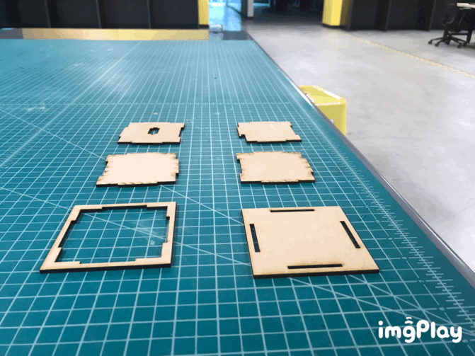
  </div>

2\. Plug servo to NodeMCU ( Yellow/Light Orange-D4, Red-3.3v, Brown-GND )
  <div style="text-align:center">
  <!-- make the following images centered -->
  
  
  </div>

---
## Software Setup

To make the process easier, you don't need to assemble everything while you set up the software. **You just need to plug your servo to the NodeMCU.** After the software is setup successfully you can then attach them to the box.

*Prerequisites*
- working Wi-Fi, you know the SSID(name) & password
- computer or phone or any other device with Wi-Fi and a web browser

We've already flashed the basic program, all you need to do is follow the below steps and connect it to your Wi-Fi.

### What We're Gonna Do - The Overall Process
This is just a high level walkthrough; detailed steps to follow are in the next section.
- Connect to NodeMCU Wi-Fi
- Tell it your own Wi-Fi name and password
- Let it connect to your Wi-Fi
- Connect your phone back to your own Wi-Fi
- Use your own Wi-Fi to browse to the device's web server to control it

### Detailed Steps 
1. Plug in the micro USB cable for the NodeMCU (just for providing power, don't need to connect to a computer)
2. Use your device (PC/phone) and connect to the Wi-Fi netowrk: "gix_iot"
3. Password: "gixmkrspc"
4. Wait for the webpage to popup, you will see this:

> (If the page didn't show up after you connected to the Wi-Fi, try to go to http://192.168.4.1/)
>
> An iPhone or Android device may change the Wi-Fi network back to your home network, since the NodeMCU doesn't have an Internet connection. You may need to ensure that "Auto Join" is turned off for your other Wi-Fi (iPhone) or forget the other network (Android); this step is only to get the NodeMCU onto your home network and then you can re-join and/or turn on "Auto Join" for your home Wi-Fi again.
5. Enter your **own Wi-Fi's** SSID(name) & password,
 you can use your home Wi-Fi, phone hotspot, etc.
6. After you see this message, **Press RST button on the NodeMCU**, let the NodeMCU reboot and connect to your own Wi-Fi
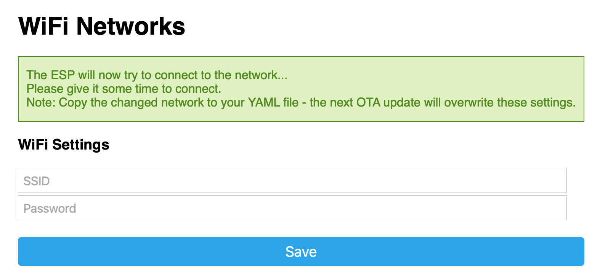
7. Disconnect your device from "gix_iot" and **reconnect your device to your own Wi-Fi**
8. Open your browser and go to [http://servo_test.local](http://servo_test.local) you will see this page:

> If you can't see this page, try refreshing the page several times in 1-2 minutes. After 1-2 minutes, if you still can't see this page. Go back to step **2.** and connect to "gix_iot" again. This time you might get a Wi-Fi list in your popup page, connect to the Wi-Fi you want.

9. Click Toggle, you can move the servo now 👋!
  
### Congratulations! 👏👏👏
Now that the Wi-Fi connection is configured, your NodeMCU will automatically connect to your Wi-Fi every time it boots up.

10. You can attach the servo and board to the enclosure
<div style="text-align:center">
<!-- make the following images centered -->
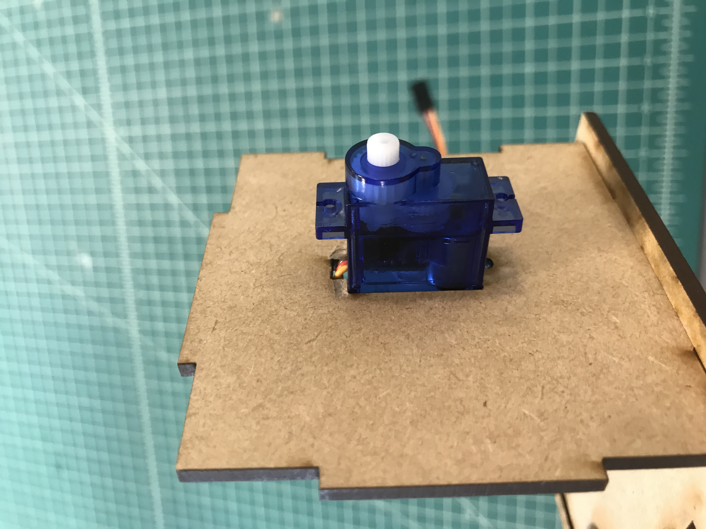
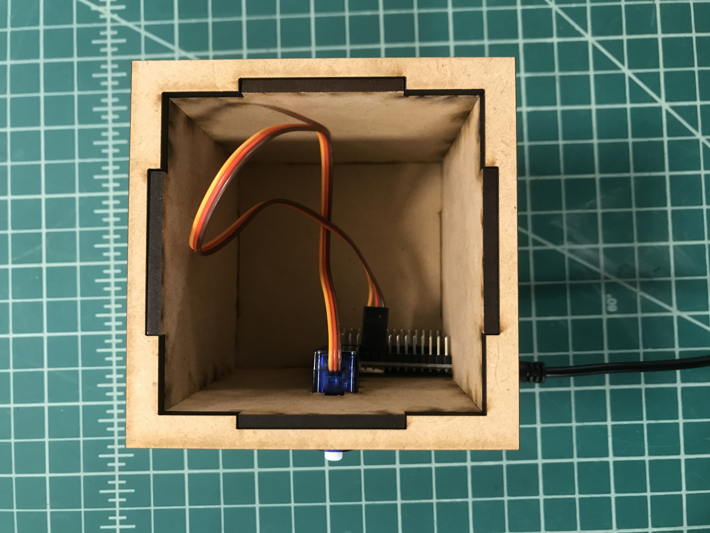
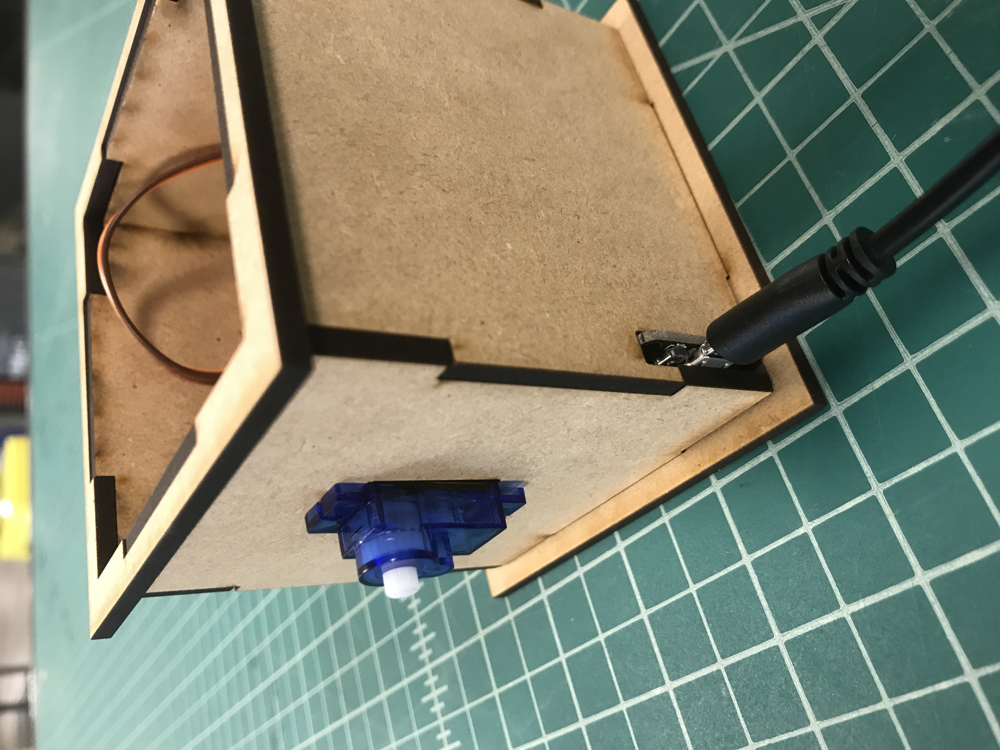
</div>

> If you want to connect to another Wi-Fi, turn off or get away from the Wi-Fi signal you previously connected to. Once the NodeMCU failed to connect to Wi-Fi, it will start "ap mode" and you can reset it from step **2.**

> In the future we will have other activities involving this device! Please see the section below, tinker and bring any ideas or changes up so we can bring that functionality to other cohort members!

## Extensibility
As the microcontroller is easily reprogrammable, the hand wave can be triggered, or its action changed by possibilities only limited by your imagination! For instance, you can easily hook ESPHome into an automation platform called Home Assistant, which will allow you to wave the hand for all sorts of triggers; for instance, if someone opens your door, you can use the ESPHome to wave. You can also change the hand itself to become an indicator; since we’re using a servo, you can control the state, or how much, the servo rotates. You can make the hand move to different positions depending on whether it’s cloudy or sunny and make the servo rotate to that predefined position when the weather changes.

### Fun ideas
Require a 5v Relay:
- [USB laser lights](https://amzn.to/3gjo8u2) 
- [Totoro w/two light modes](https://amzn.to/2TushS3)

May require ESP32 to run due to memory:
- [<$10 from Amazon digital display](https://amzn.to/3e5oylA)

## Custom Development Setup
In order to customize the microcontroller, you have to re-flash the NodeMCU again. Below are the steps that you need to do.

### For Windows:
1. Set up a new virtual environment in Python
- make sure you have python installed (open Command Prompt and type in `python`; if it opens python shell then you've confirmed Python is accessible in your Path; otherwise reinstall Python and ensure you check the box to add it to your system's path environment variable)
- locate the directory you want the virtual environment to be installed in
- in the Windows Command Prompt, enter `python -m venv venv`
  - This command invokes the python module *venv* (first parameter) and creates it inside a directory named *venv* (second parameter)
- then run `.\venv\Scripts\Activate.bat`
  - This command activates the virtual environment; you should now see your command prompt prepended with **(venv)**
- IF using Power Shell (instead of command prompt), use `.\venv\Scripts\Activate.ps1`
  - This command activates the virtual environment; you should now see your command prompt prepended with **(venv)**
- ⚠️ensure that servo is not connected to the NodeMCU before next step
2. Installing esphome
- enter `pip install esphome`
1. Download or `git clone` the [repo](https://github.com/codycodes/gix-mkrfridays-iot/archive/master.zip) and extract it anywhere (best is to put it in same folder as your venv)
- in the standalone folder, right-click and create new text document.
- copy and paste these into it.
    ap_ssid: "Servo Test Fallback Hotspot"
    ap_pass: "test12341234"
    ota_pass: "test12341234"
- rename file name to "secrets.yaml" (ensure the file extension is `.yaml` and **not** `.txt`)
4. Run!
- in Command Prompt, type and run `cd *path to the standalone folder*`
- then `esphome servo.yaml run`
- it should start installing 
- DONE!
5. You can now develop your own custom esphome components! Get started on [esphome.io](http://esphome.io)
### For macOS/Linux
1. Ensure you have python3 [installed](https://docs.python-guide.org/starting/install3/osx/)
2. Open your favorite terminal app
3. run `./install.sh`
4. run `./run.sh`
    - You can replace the `servo.yaml` file here with your own configuration!
5. You can now develop your own custom esphome components! Get started on [esphome.io](http://esphome.io)

# Remote Control (via Azure IoT Hub)

## Deploy Azure Cloud Infrastructure

### Overview
This repo contains a powerful orchestration script which creates cloud resources for the following:
* **Create an IoT Hub and devices which can connect to said hub**
  * Outputs IoT device connection strings to a file called *device_connection_strings.csv*
* **Sets up a servless app and serverless functions which map to each of the previously created IoT devices**
  * These functions allow Cloud 2 Device messages to invoke said device via HTTP requests
  * Each function URL is output to *device_function_urls.csv*
* **Generates and hosts a static site on the same storage account used for the serverless app**
  * This site acts as a dashboard which, depending on the type of device you're using, can be invoked with its respective functionality directly from the dashboard

Want a diagram? Here's what it looks like with *two* devices, but on the free tier you can create up to 400 devices for your IoT Hub. This script has no problem provisioning that many devices!
<div style="text-align:center">
<!-- make the following images centered -->

</div>

### Azure Prerequisites
 - Azure account with an active subscription (easy to sign up at https://azure.com)
 - Some shell experience (e.g. understanding of changing directories with `cd`)
 - Dev tools
   - `python` (version 3.6.x to 3.8.x at the time of this writing) (should be accessible from your system PATH environment variable)
   - `npm` (should be accessible from your system PATH environment variable)
   - `git` (should be accessible from your system PATH environment variable)
   - VSCode To configure code and assist with deployment

### Initial Setup

**Note:** These instructions should work for macOS/Linux/Windows since Python works cross platform, but we can't guarantee all platforms have been tested; if you run into an issue please open an issue [here](https://github.com/codycodes/gix-mkrfridays-iot/issues)

1. The easiest way we've found to install all the required dependencies and configure your developement environment is by doing the following:
   1. clone the repo:
  ```
  git clone https://github.com/codycodes/gix-mkrfridays-iot.git
  ```
   2. Navigate to the repo's cloned folder in your shell.
   3. From here `cd` to the path `/gix-mkrfridays-iot/azure_iot_hub/python-sdk`
   4. Create a Python virtual environment and activate it using the following commands. These commands will depend on your operating system, so please use the correct one for your OS:  
   All operating systems do this:
   ```
    python -m venv venv
   ```
  Depending on your OS and config you can choose the appropriate out of the following:  
   **Linux/macOS**
   ```
   source venv/bin/activate
   ```
  **Windows (using Powershell)**
   ```
  .\venv\Scripts\Activate.ps1
   ```
   **Windows (using cmd)**
   ```
   .\venv\Scripts\Activate.bat
   ```
   5. Now that your venv is activated, you can install the dependencies for the project:
   ```
   pip install -r requirements.txt
   ```
   6. With your venv setup and dependencies install, you can run the command `code .` to open the current directory in VSCode. If the command isn't working, [use the following guide to set it up](https://code.visualstudio.com/docs/setup/mac#_launching-from-the-command-line)
   7. Opening the directory in this way should cause VSCode to search the directory for a python virtual environment and choose that as the Python interpreter for your window. In the bottom left corner you should see something like the following:
   **Python 3.x.x 64-bit ('venv':venv)**
   This lets you know that the venv is correctly being used!
   8. You can now configure the options you'd like in the script and run using:
   ```
   python provision.py
   ```
   Where `provision.py` is located in the directory `/path/to/gix-mkrfridays-iot/azure_iot_hub/azure/provision.py`
  
## Arduino Prerequisites
### Hardware
One of the following boards:
- ESP8266 based boards with esp8266/arduino
- ESP32 based boards with espressif/arduino-esp32  
and a...
- USB cable for data transfer or other flashing hardware

### Software
- [python3.5+](https://www.python.org/downloads/) Installed and accessible via your [PATH](https://www.tutorialspoint.com/python/python_environment.htm) environment variable
- [git](https://git-scm.com)
- [Arduino IDE](https://www.arduino.cc/en/main/software)

## Setup Instructions
If any of these steps fail please double check these instructions, open an issue [here](https://github.com/codycodes/gix-mkrfridays-iot/issues/new/choose), and see if there's a solution to the issue on the official [Azure IoT Arduino repo](https://github.com/Azure/azure-iot-arduino)


### ESP8266
#### Installing Azure IoT Arduino libs
1. Open up the Arduino IDE and go to **Tools > Manage Libraries**  
    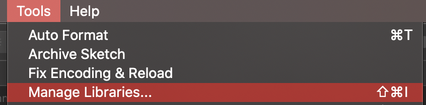
2. Install the following libraries through the Arduino IDE Library Manager:  
  `AzureIoTHub`  
  `AzureIoTUtility`  
  `AzureIoTProtocol_MQTT`  
  `AzureIoTProtocol_HTTP`  

#### Install board into Arduino IDE
 1. (Windows) Start Arduino IDE and go to **File > Preferences**  
    (macOS) Start Arduino IDE and go to **Arduino > Preferences**  
 2. In the *Additional Board Manager URLs:* field, enter `http://arduino.esp8266.com/stable/package_esp8266com_index.json`  
   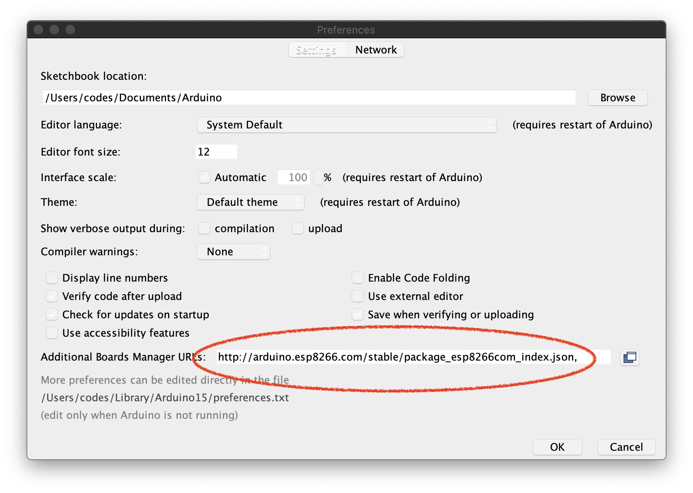  
   You can add multiple URLs for boards, separating each with a comma `,`
 3. Go to **Tools > Board: *currently selected board*** and open **Boards Manager**.  
   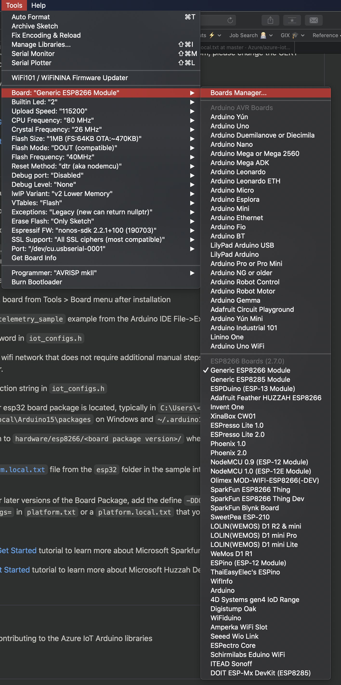  
    - In **Boards Manager**, search for *esp8266* and install esp8266 version **2.5.2 or later**.  
     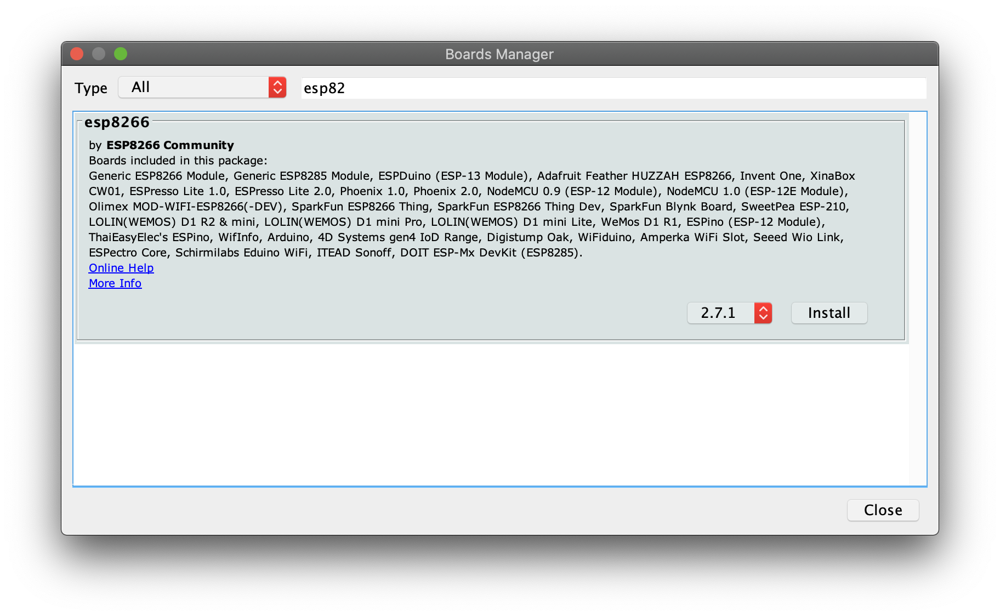  
 4. Select your ESP8266 board from **Tools > Board: *currently selected board*** menu after installation. After selection, the menu should read **Tools > Board: "Generic ESP8266 Module"**:  
     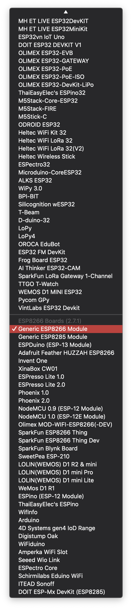  
#### Finish board setup via python script
 1. Clone this repo using: 
    
    `git clone "https://github.com/codycodes/gix-mkrfridays-iot.git"`

      - Note: if you already did this before you don't need to do it again! In that case skip to step 2.
 2. Open a terminal and `cd` to the directory you cloned the repo to. The path will be something like `/dir/to/clone/gix-mkrfridays-iot`, where `/dir/to/clone` is where you cloned the repo to.
    - You will also want to fetch the `iot_configs.h` file from either the [Azure IoT GitHub repo](https://github.com/Azure/azure-iot-arduino/blob/master/examples/iothub_ll_telemetry_sample/iot_configs.h) or the Arduino samples folder:  
    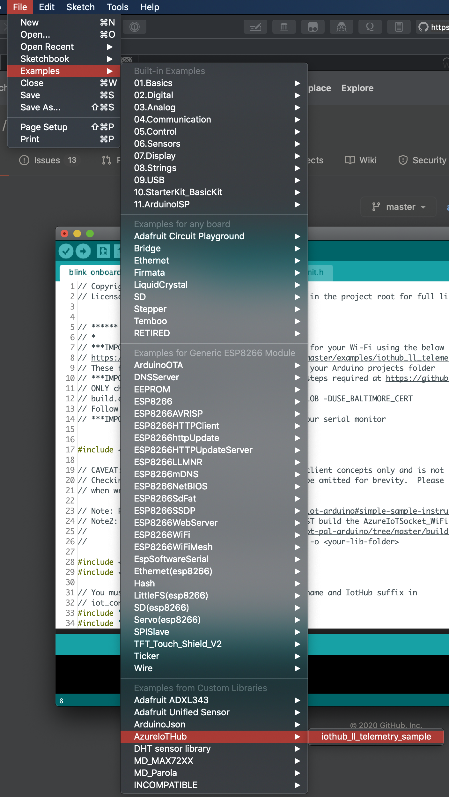  
 3. `cd` to the  `gix-mkrfridays-iot/azure_iot_hub/arduino/` and run the *script.py* program (use `python3 ./script.py` or `python ./script.py`)
    - This code automatically backs up and configures the ESP8266's *Arduino.h* and *platform.txt* files so that you can use the Azure IoT Arduino library without manual configuration!
 4. Open iot_configs.h and update the following:
    1. WiFi SSID and Password.
       - Make sure you are using a WiFi network that does not require additional manual steps after connection, such as opening a web browser and authenticating.
    2. Device Connection String. This is the connection string that your device uses to authorize its access with Azure IoT hub. If you're using this repo to generate your device connection strings, then you'll find them in a file called `device_connection_strings.csv` after running the script that sets up your IoT hub and devices!
#### Upload code to Arduino
1. Choose the example you would like to run from *quickstarts* folder located in **gix-mkrfridays-iot/arduino/quickstarts**. Open the `.ino` file in the Arduino IDE (double-click it from your file explorer).
2. Copy or move the `iot_configs.h` file you added Wi-Fi credentials into the same Arduino folder. 
3. Ensure that the correct serial port and board are selected otherwise you can't upload the code.  
   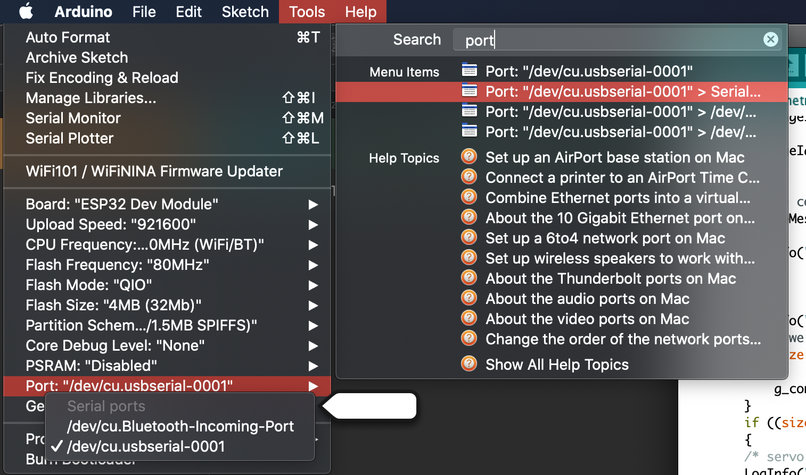  
4. Plug the Arduino in. Compile and upload the sample by clicking the *checkmark* in the top left corner of the IDE.
5. To use the serial monitor, ensure that your board's baud rate is set to **115200** baud.

### ESP32
#### Installing Azure IoT Arduino libs
1. This step is a little different than on the esp8266 instructions since we need to manually build the lib `AzureIoTSocket_WiFi`, which is required. Do the following:
  - run `git clone --recursive 'https://github.com/Azure/azure-iot-pal-arduino.git'`
    - After running this command, `cd` to the dir `/path/to/azure-iot-pal-arduino` and run the following: `git submodule update --init --recursive`
    - now `cd` to the folder containing the script to build the libs: `/azure-iot-pal-arduino/build_all/make_sdk.py`
      - You can run this script and it will generate the libs in the current directory (not recommended) or you can have it output to a different location using the `-o` option. The libraries folder is dependent on platform/user configuration, but in my case on macOS it was in the following path: **/Users/my_user/Documents/Arduino/libraries**. Therefore in this case you can use the following command to output the built libs: `python make_sdk.py -o /Users/my_user/Documents/Arduino/libraries`
2. Check **/Users/my_user/Documents/Arduino/libraries** to verify that Install the following libraries installed correctly:
  `AzureIoTSocket_WiFi`
  `AzureIoTHub`  
  `AzureIoTUtility`  
  `AzureIoTProtocol_MQTT`  
  `AzureIoTProtocol_HTTP`  

#### Install board into Arduino IDE
 1. (Windows) Start Arduino IDE and go to **File > Preferences**  
    (macOS) Start Arduino IDE and go to **Arduino > Preferences**  
 2. In the *Additional Board Manager URLs:* field, enter `https://dl.espressif.com/dl/package_esp32_index.json`  
   You can add multiple URLs for boards, separating each with a comma `,`
 3. Go to **Tools > Board: *currently selected board*** and open **Boards Manager**.  
     
    - In **Boards Manager**, search for *esp32* and install esp32 version **1.0.2 or later**.
     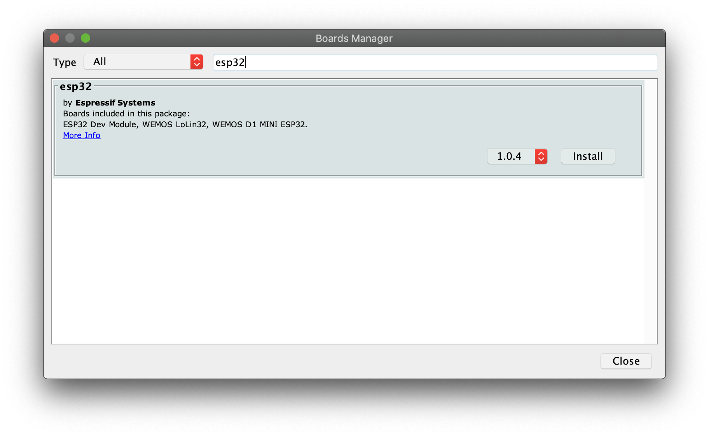  
 4. Select your ESP32 board from **Tools > Board: *currently selected board*** menu after installation. After selection, the menu should read **Tools > Board: "ESP32 Dev Module"**:  
     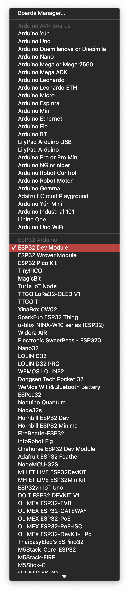  
#### Finish board setup via python script
 1. Clone this repo using: 
    
    `git clone "https://github.com/codycodes/gix-mkrfridays-iot.git"`

      - Note: if you already did this before you don't need to do it again! In that case skip to step 2.
 2. Open a terminal and `cd` to the directory you cloned the repo to. The path will be something like `/dir/to/clone/gix-mkrfridays-iot`, where `/dir/to/clone` is where you cloned the repo to.
    - You will also want to fetch the `iot_configs.h` file from either the [Azure IoT GitHub repo](https://github.com/Azure/azure-iot-arduino/blob/master/examples/iothub_ll_telemetry_sample/iot_configs.h) or the Arduino samples folder:
      
 3. `cd` to the  `gix-mkrfridays-iot/azure_iot_hub/arduino/` and run the *script.py* program (use `python3 ./script.py` or `python ./script.py`)
    - This code automatically backs up and configures the ESP32's *platform.txt* file so that you can use the Azure IoT Arduino library without manual configuration!
 4. Open iot_configs.h and update the following:
    1. WiFi SSID and Password.
       - Make sure you are using a WiFi network that does not require additional manual steps after connection, such as opening a web browser and authenticating.
    2. Device Connection String. This is the connection string that your device uses to authorize its access with Azure IoT hub. If you're using this repo to generate your device connection strings, then you'll find them in a file called `device_connection_strings.csv` after running the script that sets up your IoT hub and devices!
#### Upload code to Arduino
1. Choose the example you would like to run from *quickstarts* folder located in **gix-mkrfridays-iot/arduino/quickstarts**. Open the `.ino` file in the Arduino IDE (double-click it from your file explorer).
2. Copy or move the `iot_configs.h` file you added Wi-Fi credentials into the same Arduino folder. 
3. Ensure that the correct serial port and board are selected otherwise you can't upload the code.  
    
4. Plug the Arduino in. Compile and upload the sample by clicking the *checkmark* in the top left corner of the IDE.
5. To use the serial monitor, ensure that your board's baud rate is set to **115200** or **1000000** baud.
