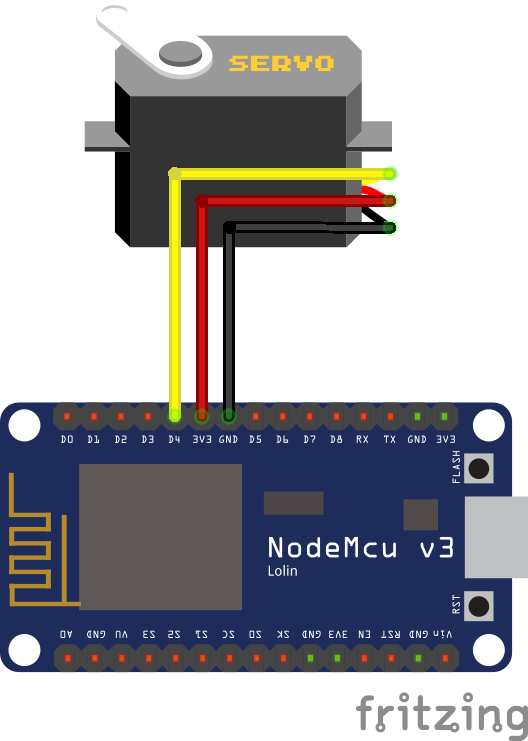
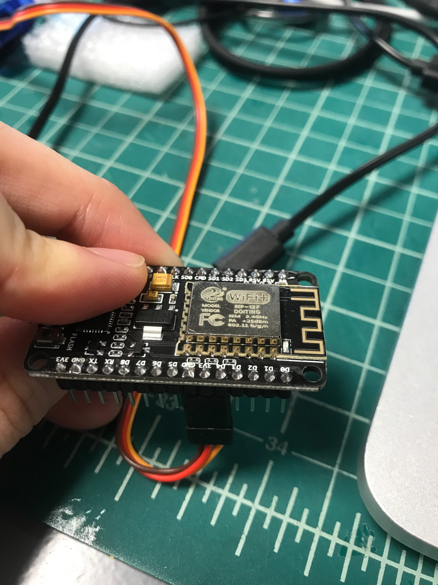
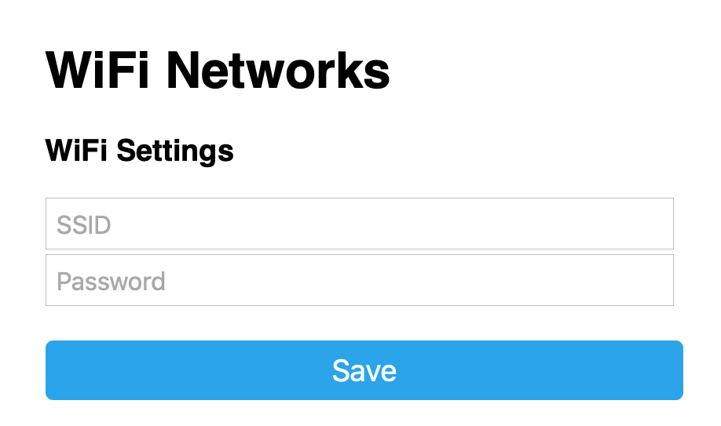
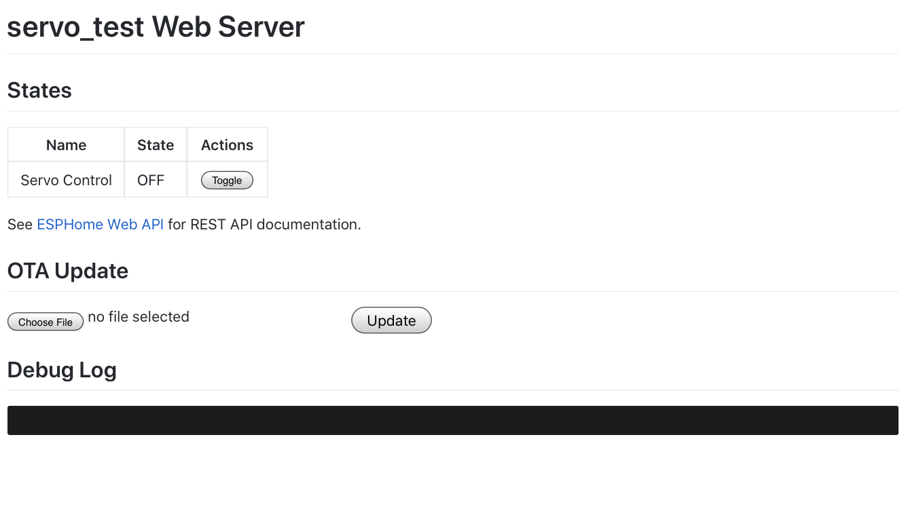

## About
The NodeMCU is an open-source firmware and development kit which allows us to use a low-cost ESP8266 WiFi MCU to provide “the best platform for IOT application development at the lowest cost” [NodeMCU homepage](https://www.nodemcu.com/index_en.html).  

ESPHome is the software and firmware flasher we’ll be using; it’s a “system to control your ESP8266/ESP32 by simple yet powerful configuration files and control them remotely through Home Automation systems” [ESPHome homepage](https://esphome.io).

# Local Control (via ESPHome)

## Upon Completion
By completing this project you will have a device which can wave 👋 when its virtual button is pressed via its website.

## Components
- NodeMCU WiFi development board *1
- Servo motor (with three types of arm) *1
- Enclosure box (MDF sheet) *6
- Waving sign *1
  
---
## Hardware Setup
1. Assemble the box
> In progress
2. Plug servo to NodeMCU ( Yellow-D4, Red-3.3v, Brown-GND )

<!-- make the following images centered -->

---
## Software Setup
*Prerequisites*
- working WiFi, you know the SSID(name) & password
- computer or phone

We've already flashed the basic program, all you need to do is follow the below steps and connect it to your WiFi.

### The Overall Process
1. Connect to NodeMCU WiFi
2. Tell it your own WiFi name and password
3. Let it connect to your WiFi
4. Connect your phone back to your own WiFi
5. Use your own WiFi to browse to the device's web server to control it

### Detailed Steps
1. Plug in the micro USB cable (just for providing power, don't need to connect to a computer)
2. Use your device (PC/phone) and connect to the WiFi netowrk: "gix_iot"
3. Password: "gixmkrspc"
4. Wait for the webpage to popup, you will see this:

> (If the page didn't show up after you connected to the WiFi, try to go to http://192.168.4.1/)
>
> An iPhone or Android device may change the WiFi network back to your home network, since the NodeMCU doesn't have an Internet connection. You may need to ensure that "Auto Join" is turned off for your other WiFi (iPhone) or forget the other network (Android); this step is only to get the NodeMCU onto your home network and then you can re-join and/or turn on "Auto Join" for your home WiFi again.
5. Enter your **own WiFi's** SSID(name) & password,
 you can use your home WiFi, phone hotspot, etc.
6. Wait a few seconds after you see the success message. Press RST button on the NodeMCU and let the NodeMCU connect to your WiFi
7. Disconnect your device from "gix_iot" and reconnect your device to your own WiFi
8. Open your browser and go to [http://servo_test.local](http://servo_test.local) you will see this page:

> If you can't see this page, try refreshing the page several times in 1-2 minutes. After 1-2 minutes, if you still can't see this page. Go back to step **2.** and connect to "gix_iot" again. This time you might get a WiFi list in your popup page, connect to the WiFi you want.

9. Click Toggle, you can move the servo now 👋!
  
### Congratulations! 👏👏👏
Now that the WiFi connection is configured, your NodeMCU will automatically connect to your WiFi every time it boots up.

> If you want to connect to another WiFi, turn off or get away from the WiFi signal you previously connected to. Once the NodeMCU failed to connect to WiFi, it will start "ap mode" and you can reset it from step **2.**

> In the future we will have other activities involving this device! Please see the section below, tinker and bring any ideas or changes up so we can bring that functionality to other cohort members!

## Extensibility
As the microcontroller is easily reprogrammable, the hand wave can be triggered, or its action changed by possibilities only limited by your imagination! For instance, you can easily hook ESPHome into an automation platform called Home Assistant, which will allow you to wave the hand for all sorts of triggers; for instance, if someone opens your door, you can use the ESPHome to wave. You can also change the hand itself to become an indicator; since we’re using a servo, you can control the state, or how much, the servo rotates. You can make the hand move to different positions depending on whether it’s cloudy or sunny and make the servo rotate to that predefined position when the weather changes.

## Custom Development Setup
In order to customize the microcontroller, you have to re-flash the NodeMCU again. Below are the steps that you need to do.

For Windows:
1. Set up a new virtual environment
- make sure you have python installed (open Command Prompt and type in "python")
- locate the directory you want the virtual environment to be installed in
- in Command Prompt, enter "python -m venv venv"
- then ".\venv\Scripts\Activate.bat"
- IF using Power Shell, use ".\venv\Scripts\Activate.ps1"
- ensure that servo is not connected to the NodeMCU before next step
2. Installing esphome
- enter "install esphome"
3. Download zip and extract
- in the standalone folder, right-click and create new text document.
- copy and paste these into it.
    ap_ssid: "Servo Test Fallback Hotspot"
    ap_pass: "test12341234"
    ota_pass: "test12341234"
- rename file name as "secrets.yaml"
4. Run!
- in Command Prompt, "cd *path to the standalone folder*"
- then "esphome servo.yaml run"
- it should start installing 
- DONE!
